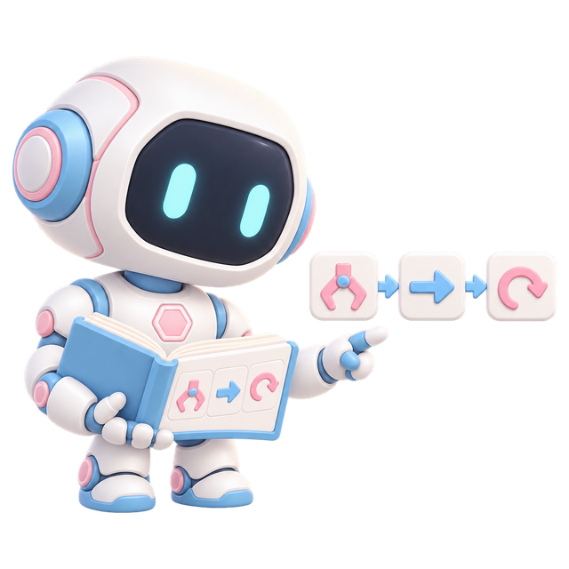
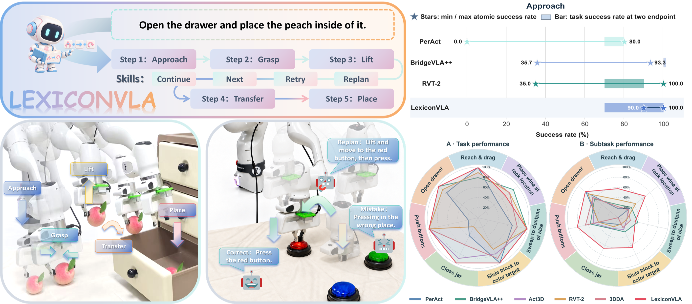

<p align="center"></p>

# LexiconVLA: Learning Reusable Atomic Action Codebooks for Unseen Tasks

**Zeming Wei**<sup>1,*</sup>, **Jianheng Ye**<sup>1,*</sup>, **Xinshuai Song**<sup>1</sup>, **Sirui Chen**<sup>1</sup>, **Yang Liu**<sup>1,3,†</sup>, **Liang Lin**<sup>1,2,3</sup>

<sup>1</sup> Sun Yat-sen University · <sup>2</sup> Pengcheng Laboratory · <sup>3</sup> X-Era AI Lab  
<sup>*</sup> Equal contribution · <sup>†</sup> Corresponding author

[Project Page](https://weizeming0821.github.io/LexiconVLA/) · [arXiv](https://arxiv.org/abs/2609.36774) · [PDF](https://arxiv.org/pdf/2609.36774) · [GitHub](https://github.com/HCPLab-SYSU/LexiconVLA)

## Abstract

Vision-language-action (VLA) models struggle to reuse recurring interactions in unseen tasks. Our diagnostic study reveals that reliable task completion does not imply consistent execution of constituent atomic actions across task contexts. We present *LexiconVLA*, a retrievable atomic-action lexicon for cross-task reuse. Global and detail codebooks capture shared interaction structure and fine-grained execution variation, respectively, preserving both reusable patterns and execution details. Visual-Atomic Action Alignment couples trajectory reconstruction from visual state changes with visual outcome prediction from action codes, grounding the lexicon in motion and its effects. We learn these codebooks with trajectory reconstruction and visual alignment on our *AtomAction* Dataset of 57,803 segments from 69 tasks. A planner and scene-aware adapter translate new goals into code-conditioned subtasks for a shared policy, without skill-specific experts or deployment-time parameter updates. Across five policy backbones on 26 RLBench tasks, *LexiconVLA* largely maintains performance on 18 seen tasks while improving success on 8 tasks held out from policy training. With BridgeVLA, unseen-task success rises from 16.67% to 34.17% (+17.50 percentage points), and overall success reaches 71.08%. Real-robot experiments demonstrate stepwise execution and failure recovery.

Demos on the project page: interactive RLBench simulation rollouts (25 tasks, success / RETRY / REPLAN recoveries vs. BridgeVLA failures) and real-robot comparisons with BridgeVLA and π<sub>0.5</sub>.

## Teaser



## Citation

```bibtex
@misc{wei2026lexiconvlalearningreusableatomic,
  title={LexiconVLA: Learning Reusable Atomic Action Codebooks for Unseen Tasks},
  author={Zeming Wei and Jianheng Ye and Xinshuai Song and Sirui Chen and Yang Liu and Liang Lin},
  year={2026},
  eprint={2609.36774},
  archivePrefix={arXiv},
  primaryClass={cs.RO},
  url={https://arxiv.org/abs/2609.36774},
}
```
